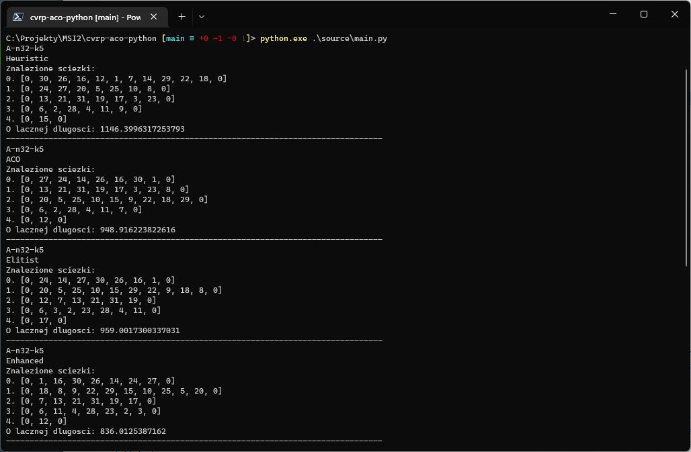

# cvrp-aco-python (Python implementation of an ACO-based approaches for solving CVRP problem)

Simple Python implementation of an AI-based algorithm using ACO (ant colony optimization) to solve a CVRP (Capacitated Vehicle Routing) problem. Project created for the Artifical Intelligence classes on Warsaw University of Technology.

Due to the purpose stated above, all documentation and program output is provided in Polish.

The project is provided as is and is no longer maintained. Author does not guarantee the correctness of the implementation nor the tests performed.

## Technology
Project is implemented using Python 3.10, with numpy library.

## Purpose
Initial goal of the project was to understand and analyze a CVRP problem as well as basic AI method such as ACO. This is not a research project - all information and topics covered are already well-known as AI basics.

Implementation covers and compares four different approaches to solving the problem:
* Heuristic algorithm - chosing the best reachable temporary state, without using AI algorithms.
* Base ACO algorithm - base ant colony optimization as known in literature.
* Elitist ACO algorithm - some part of ants are marked as elitist, and their paths are "rewarded" with extra pheromones.
* Enhanced ACO algorithm with reversing subpaths - well-known 2-opt algorithm which modifies locally found solution by looking for alternatives with reversed order of a section of the path.

## Structure
Files are split into four directories:
* _docs_ - documentation (in Polish) - report, presentation of the results and LaTeX source code for the report
* _source_ - source code of the project, including main logic as well as the scripts used for testing (filenames _test\_*.py_)
* _testresults_ - output files with test results
* _testsets_ - input files with instances of the problem

## Setup and usage
The implementation is designed to be ran by openning the _main.py_ script using python, with two optional input arguments: number of trucks and maximum range of each track accordingly. If those are not provided, default values are used - maximum range of 300 and number of trucks defined in the test file.

All other parameters used by implemented algorithms are hardcoded in _main.py_ file as constant values, based on author's experiments.

Scripts used for testing (filenames _test\_*.py_) can also be ran with pyton, however they do not support any input arguments and are provided as is.

## Sources
1. Marco Dorigo and Thomas Stützle. _"Ant Colony Optimization"_. doi: 10.7551/mitpress/1290.003.0007.
1. Marco Dorigo, Vittorio Maniezzo, and Alberto Colorni. _"Ant system: Optimization by a colony of cooperating agents"_. doi: 10.1109/3477.484436.
1. Marco Dorigo and Gianni Di Caro. _“Ant colony optimization: A new meta-heuristic”_. doi: 10.1109/CEC.1999.782657.
1. Siti Fatimah Mohamad Ayop, Mohd Shahizan Othman, and Lizawati Mi Yusuf. _“Ant Colony Optimization Using Different Heuristic Strategies for Capacitated Vehicle Routing Problem”_. doi: 10.1088/1757-899X/864/1/012082.
1. Philippe Augerat. _“Approche polyèdrale du problème de tournées de véhicules”_.